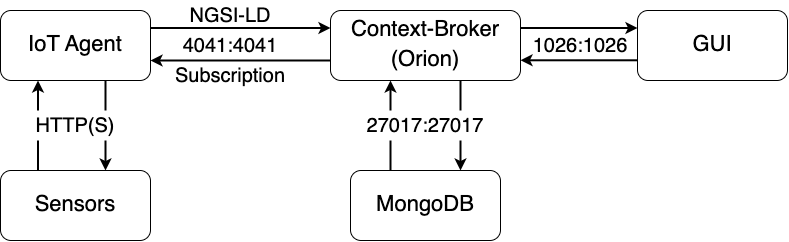
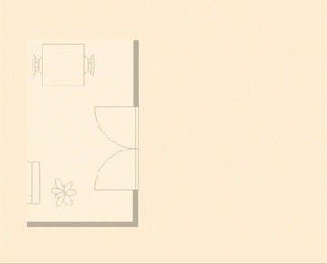

# Smart-library-EMR

## Assignment
Design and implementation of a software prototype for the tracking of books and seats. The project builds software to monitor library seat availability, which will allow a student to find a free seat to study and access learning materials related to specific training pathways.
The prototype collects the data and tracks the actions performed by the students near/in the library and proposes access to the learning content of the student's course of study.

## Resources
Resources and software that we used:
- [NGSI-LD](https://fiware-datamodels.readthedocs.io/en/stable/ngsi-ld_howto/index.html): information model used to querying and subscribing to context information
- [Docker](https://www.docker.com/): software used to incapsulate the application into a container
- [MongoDB](https://www.mongodb.com/): DBMS used to manage all the data
- [IoT Agent](https://fiware-tutorials.readthedocs.io/en/stable/iot-agent/#:~:text=An%20IoT%20Agent%20is%20a,using%20their%20own%20native%20protocols.): component used to act as an intermediary between sensors and the Context Broker
- [Context Broker: Orion-LD](https://github.com/FIWARE/context.Orion-LD): component used to provide easy access to information context

## How to start and stop services
To start the services is easy:
```
$ ./services start
```
after you can connect to http://localhost:5050/

To stop the serveces it’s easy the same way
```
$ ./services stop
```

## Prototype architecture


## Use cases: someone enters the library


## Use cases: someone take a book


## Use cases: someone is near the library

